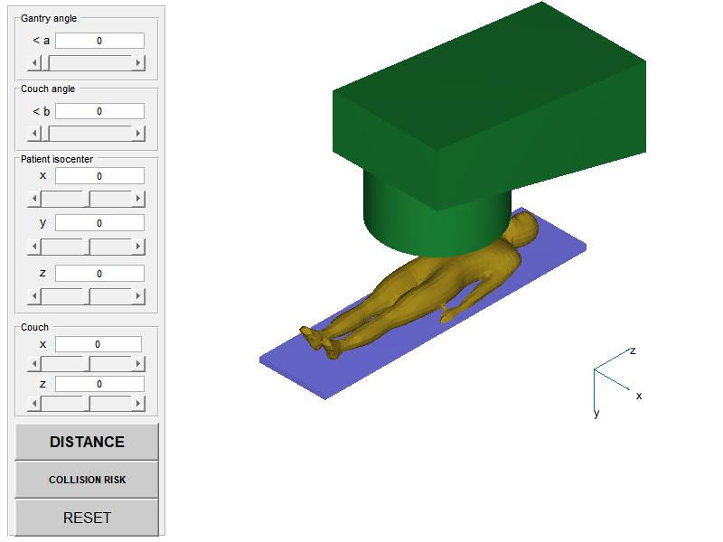
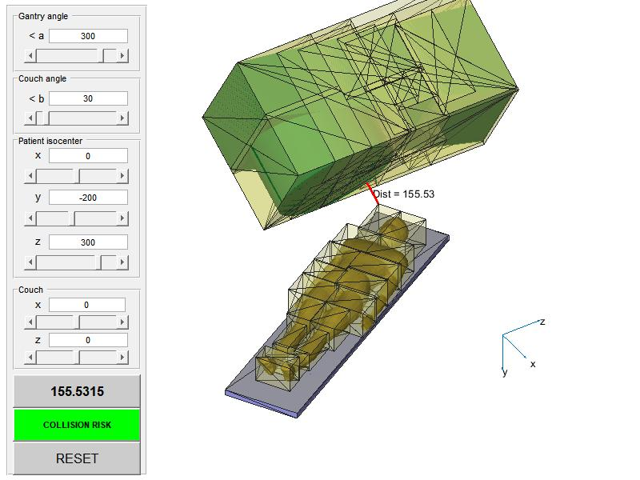

[//]: # (RadCollision-MATLAB)

This folder contains one flavor (or interface layer) of RadCollision. For other languages, consult https://github.com/mghro/rad-collision

Licensing
---------

Please refer to https://github.com/mghro/rad-collision/blob/main/README.md and https://github.com/mghro/rad-collision/blob/main/LICENSE, as well as to the licenses of the git submodules included in the current repository.

Citation
--------

F Hueso-González et al 2020 - Biomed. Phys. Eng. Express 6 055013, "An open-source platform for interactive collision prevention in photon and particle beam therapy treatment planning". https://doi.org/10.1088/2057-1976/aba442 https://arxiv.org/abs/2007.05248

Requirements
------------

- MATLAB 2016a or higher
- 3D model of your nozzle, couch and patient as STL files

For first attempts, you can use the open-source STL files stored in this [PR](https://github.com/mghro/rad-collision/issues/21#issuecomment-1073840985) or in [https://github.com/SlicerRt/SlicerRT/tree/master/RoomsEyeView/TreatmentMachineModels](SlicerRT).
For convenience, these archives are included in the present distribution

How to use
----------

- Open MATLAB
- Change path to downloaded folder and run RadCollisionMatlab
- To overcome the defaults, run `RadCollisionMatlab(args)` with the proper arguments, pointing at the path where the STL files are stored
- Alternatively, modify the default path and STL names in the beginning of the function in the RadCollisionMatlab.m file

3D model format
---------------

- The file type should be STL
- The model origin shall be in the isocenter
- The perspective should match that of an observer standing in front of the gantry
- More information is given in the header of https://github.com/mghro/rad-collision/blob/split/RayStation/collision_detection.py

Authors
-------

- José L. Hueso
- Damián Ginestar
- Jaime Riera
- Fernando Hueso-González

JL Hueso, D Ginestar and J Riera are with Instituto de Matemática Multidisciplinar (Universitat Politècnica de València). F Hueso-González is with Instituto de Física Corpuscular (CSIC / UVEG).
